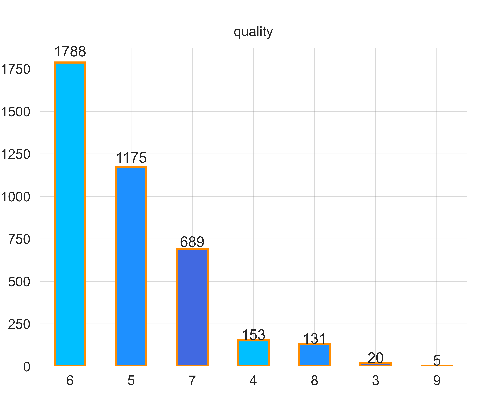
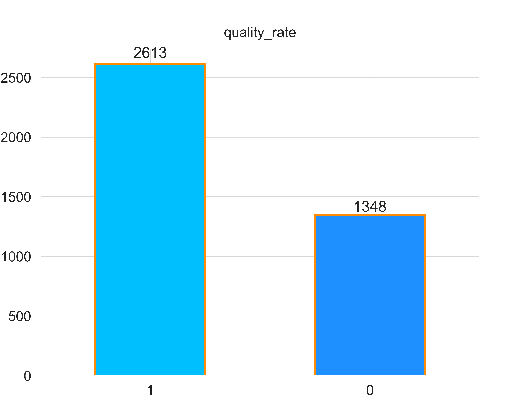
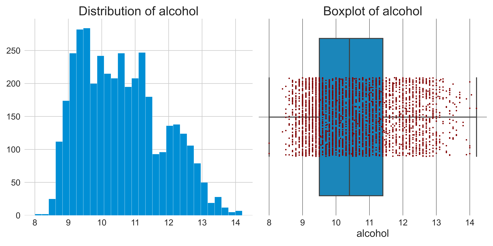
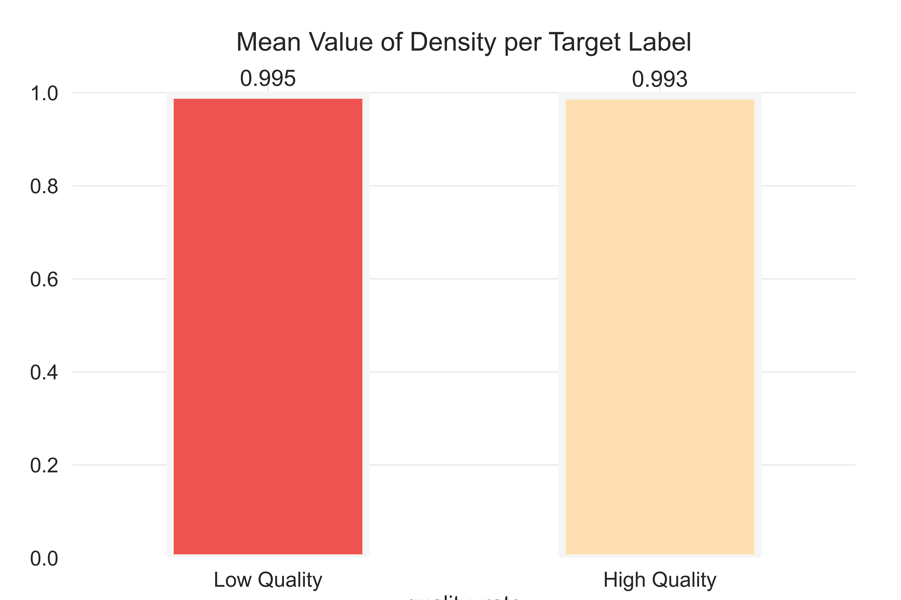
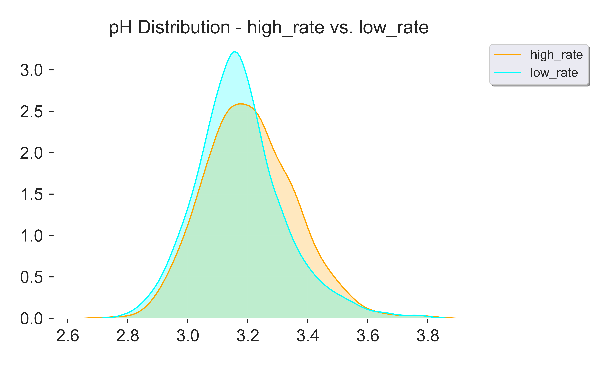

---
# White Wine quality prediction

## Introduction
The white wine is a variant of the Portuguese **"Vinho Verde"** wine **_[UCI](https://archive.ics.uci.edu/ml/datasets/Wine+Quality)_** which is a unique and valued wine in the wine industry **_[Vinho Verde](https://www.vinhoverde.pt/en/history-of-vinho-verde)_**.
The origin of Vinho Verde which is one of the largest and oldest wine regions in the world refers to the natural characteristics of the region where the wines are being made. The region produces dense green foliage as a natural characteristic and occupies the northwest of Portugal **_[Vinho Verde](https://www.vinhoverde.pt/en/history-of-vinho-verde)_**. 

## Dataset, Features and Target Variable
The dataset has 4898 entries with 12 columns and it is available from the **_[UCI machine learning repository](https://archive.ics.uci.edu/ml/datasets/wine+quality)_**.

### Data Features
The data features consist of only physicochemical properties **_[UCI](https://archive.ics.uci.edu/ml/datasets/Wine+Quality)_** of white wines and below are the dataset features;

+ **_fixed acidity_**: Most acids involved with wine or fixed or nonvolatile (do not evaporate readily).
---
+ **_volatile acidity_**: Amount of acetic acid in wine.
---
+ **_citric acid_**: Found in small quantities, citric acid can add 'freshness' and flavor to wines.
---
+ **_residual sugar_**: Amount of sugar remaining in the wine after wine fermentation stops.
---
+ **_chlorides_**: Amount of salt in the wine.
---
+ **_free sulfur dioxide_**: Free form of SO2 exists in equilibrium between molecular SO2 (as a dissolved gas) and bisulfite ion.
---
+ **_total sulfur dioxide_**: Amount of free and bound forms of S02.
---
+ **_density_**: Density of the wine.
---
+ **_pH_**: Describes how acidic or basic a wine is on a scale from 0 (very acidic) to 14 (very basic).
---
+ **_sulphates_**: A wine additive which can contribute to sulfur dioxide gas (S02) levels.
---
+ **_alcohol_**: Alcohol percentage of the wine.
---
+ **_quality_**: Target variable.
---
All data values were recorded as continous values of type `float64` with the exception of the output feature (`quality`) which is of the type `int64`.

### Missing Values
There were **no missng values*** found out of the 4898 entries of the dataset.

### Duplicated Values
There were **937 duplicated values** found in the dataset and they were treated by droping them and keeping the first instance of the duplicated values.

### Target Variable
The target variable `quality` is based on sensory data that ranges from **0** (*very bad*) to **10** (*very excellent*). However, upon analysing the data, it was observed that the instances of the `quality` attribute of the dataset had a data distribution that ranges from 3 to 9 which makes the problem to be a classification problem as shown below.

Upon realizing that, the number of instances for each recorded value was counted and the results (from the highest to the lowest) indicated that there were **1788** wines that had a wine quality of **6**, **1175** wines of wine quality **5**, **689** of wine quality **7**, **153** of wine quality **4** and **131, 20 and 5** for wine quality **8, 3 and 9** respectively.

A different target variable was then created for the dataset to classify wines as **`low quality`** wines and **`high quality`** wines with `high quality` wines being wines that have a quality value **`greater than`** the **`mean value`** of the output (`quality`) data feature and `low quality` wines, wines with `quality` values **`less than`** the `mean value` of the quality feature. 
After creating the target variable, it was observed that, the number of wines that were classified as high quality wines were greater than the number of wines that were classified as low quality wines which makes the problem to be dealt with an **_imbalanced classification problem_** as shown below.

## Exploration Data Analysis

### Correlation of Data Features
The ouput feature isn't strongly correlated to any of the physicochemical features of the dataset with **`alcohol`** having the highest correlation value of **`0.46`** with the target feature. However, there are strong correlations between some of the physicochemical features.

+ **`residual Sugar`** has a correlation value of **`0.82`** with **`density`**, 
---
+ **`total sulfur dioxide`** has a correlation value of **`0.62`** with **`free sulfur dioxide`**, 
---
+ **`density`** has a correlation value of **`0.54`** with **`total sulfur dioxide`** 
---
+ and **`alcohol`** has a correlation value of **`-0.76`** with **`density`**.
---
The figure below gives a summary of the correlation of data features.

### Outliers
A total number of **`1018.0`** outliers were found in the dataset with **`citric acid`** being the data feature with the highest number of outliers (**`223.00`**) followed by **`chlorides`** (**`178.00`**) and **`alcohol`** having the least with **`no outliers`** present.

A summary of the outliers can be found as a csv file named **`outlier_info.csv`** in the **`csv_tables`** directory of this repository.

Here, you can see a figure of the distribution and boxplot of **`alcohol`**, all other plots can be found in the **`White Wine Quality EDA and Data Preprocessing`** notebook and also in the **`figures`** directory of this repository.

### Feature Statistics
Also, upon analysing the dataset, some interesting insights was observed on the features of the dataset;

+ **`fixed acidity`** of **`high quality white wines`** have a **`mean value of 6.779`**, whiles **`low quality white wines`** have a **`mean value of 6.957`**, 
---
+ **`residual sugar`** of **`high quality white wines`** have a **`mean value of 5.532`** whiles **`low quality white wines`** have a **`mean value of 6.656`**, 
---
+ **`density`** of **`high quality white wines`** have a **`mean value of 0.993`** whiles **`low quality white wines`** have a **`mean value of 0.995`**.
---
+ **`alcohol`** of **`high quality white wines`** have a **`mean value of 10.940`** whiles **`low quality white wines`** have a **`mean value of 9.909`**.
---

Here, you can see a **`bar plot`** for the **`density`** feature, all the other plots can be seen in the **`White Wine Quality EDA and Data Preprocessing`** notebook and also in the **`figures`** directory of this repository.

Summary of this statistics on all data features can be found as two csv files named **`features_mean_stats_per_target_variable.csv`** and **`features_std_stats_per_target_variable.csv`** in the **`csv_tables`** directory in this repository.

**`KDE plots`** of the data features per the output feature can be found in the **`White Wine Quality EDA and Data Preprocessing`** notebook and also inside the folder named **`figures`** in this repository.

Below is the **`KDE plot`** of **`ph`**.

## Data Preprocessing

## Modelling

## Evaluation

## Conclusion and Recommendation

### Conclusion

### Recommendation
