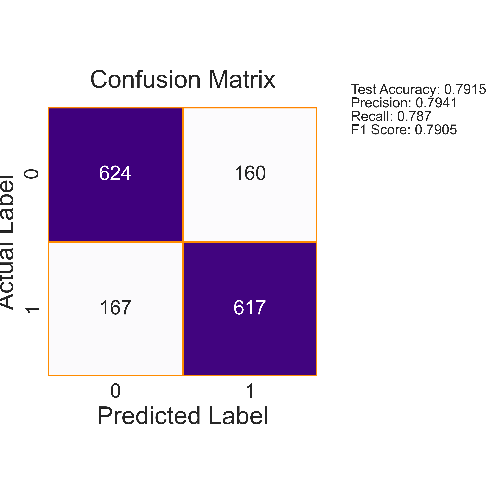
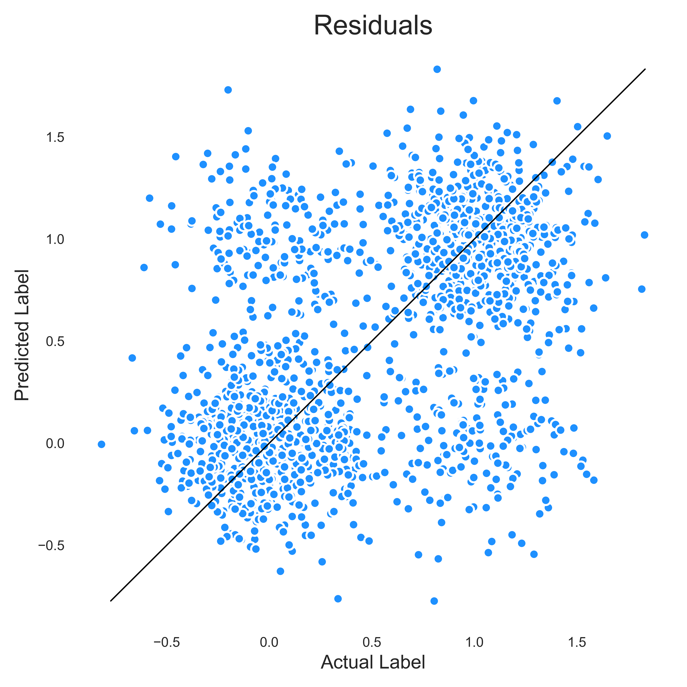

---
# White Wine quality prediction

## Introduction
The white wine is a variant of the Portuguese **"Vinho Verde"** wine (**_[UCI](https://archive.ics.uci.edu/ml/datasets/Wine+Quality)_**) which is a unique and valued wine in the wine industry (**_[Vinho Verde](https://www.vinhoverde.pt/en/history-of-vinho-verde)_**).
The origin of Vinho Verde which is one of the largest and oldest wine regions in the world refers to the natural characteristics of the region where the wines are being made. The region produces dense green foliage as a natural characteristic and occupies the northwest of Portugal (**_[Vinho Verde](https://www.vinhoverde.pt/en/history-of-vinho-verde)_**). 

## Dataset, Features and Target Variable
The dataset has **`4898 entries`** (rows) with 12 columns and it is available at the **_[UCI machine learning repository](https://archive.ics.uci.edu/ml/datasets/wine+quality)_**.

### Data Features
The data features consist of only physicochemical properties (**_[UCI](https://archive.ics.uci.edu/ml/datasets/Wine+Quality)_**) of white wines and below are the dataset features;

+ **_fixed acidity_**: Most acids involved with wine or fixed or nonvolatile (do not evaporate readily).
---
+ **_volatile acidity_**: Amount of acetic acid in wine.
---
+ **_citric acid_**: Found in small quantities, citric acid can add 'freshness' and flavor to wines.
---
+ **_residual sugar_**: Amount of sugar remaining in the wine after wine fermentation stops.
---
+ **_chlorides_**: Amount of salt in the wine.
---
+ **_free sulfur dioxide_**: Free form of SO2 exists in equilibrium between molecular SO2 (as a dissolved gas) and bisulfite ion.
---
+ **_total sulfur dioxide_**: Amount of free and bound forms of S02.
---
+ **_density_**: Density of the wine.
---
+ **_pH_**: Describes how acidic or basic a wine is on a scale from 0 (very acidic) to 14 (very basic).
---
+ **_sulphates_**: A wine additive which can contribute to sulfur dioxide gas (S02) levels.
---
+ **_alcohol_**: Alcohol percentage of the wine.
---
+ **_quality_**: Target variable.
---
All data values were recorded as continous values of type `float64` with the exception of the output feature (`quality`) which is of the type `int64`.

### Missing Values
There were **no missng values** found in the 4898 entries of the dataset.

### Duplicated Values
There were **937 duplicated values** found in the dataset and they were treated by droping them and keeping the first instance of each duplicated value.

### Target Variable
The target variable `quality` is based on sensory data that ranges from **0** (*very bad*) to **10** (*very excellent*) (**_[UCI](https://archive.ics.uci.edu/ml/datasets/Wine+Quality)_**). However, upon analysing the data, it was observed that the instances of the `quality` attribute of the dataset had a data distribution that ranges from 3 to 9 which makes the problem to be considered as a classification problem as shown below.

Upon realizing that, the number of instances for each recorded value was counted and the results (from the highest to the lowest) indicated that there were **1788** wines that had a wine quality of **6**, **1175** wines of wine quality **5**, **689** of wine quality **7**, **153** of wine quality **4** and **131, 20 and 5** for wine quality **8, 3 and 9** respectively.

A different target variable was then created for the dataset to classify wines as **`low quality`** wines and **`high quality`** wines with `high quality` wines being wines that have a quality value **`greater than`** the **`mean value`** of the output (`quality`) data feature and `low quality` wines, wines with `quality` values **`less than`** the `mean value` of the quality feature. 
After creating the target variable, it was observed that, the number of wines that were classified as high quality wines were greater than the number of wines that were classified as low quality wines which makes the problem to be dealt with an **_imbalanced classification problem_** as shown below.

## Exploration Data Analysis

### Correlation of Data Features
The output feature isn't strongly correlated to any of the physicochemical features of the dataset with **`alcohol`** having the highest correlation value of **`0.46`** with the target feature. However, there are strong correlations between some of the physicochemical features.

+ **`residual Sugar`** has a correlation value of **`0.82`** with **`density`**, 
---
+ **`total sulfur dioxide`** has a correlation value of **`0.62`** with **`free sulfur dioxide`**, 
---
+ **`density`** has a correlation value of **`0.54`** with **`total sulfur dioxide`** 
---
+ and **`alcohol`** has a correlation value of **`-0.76`** with **`density`**.
---
The figure below gives a summary of the correlation of data features.

### Outliers
A total number of **`1018.0`** outliers were found in the dataset with **`citric acid`** being the data feature with the highest number of outliers (**`223.00`**) followed by **`chlorides`** (**`178.00`**) and **`alcohol`** having the least with **`no outliers`** present.

A summary of the outliers can be found as a csv file named **`outlier_info.csv`** in the **`csv_tables`** directory of this repository.

Here, you can see a figure of the distribution and boxplot of **`alcohol`**, all other plots can be found in the **`White Wine Quality EDA and Data Preprocessing`** notebook and also in the **`figures`** directory of this repository.

### Feature Statistics
Also, upon analysing the dataset, some interesting insights was observed about the dataset features;

+ **`fixed acidity`** of **`high quality white wines`** have a **`mean value of 6.779`**, whiles **`low quality white wines`** have a **`mean value of 6.957`**, 
---
+ **`residual sugar`** of **`high quality white wines`** have a **`mean value of 5.532`** whiles **`low quality white wines`** have a **`mean value of 6.656`**, 
---
+ **`density`** of **`high quality white wines`** have a **`mean value of 0.993`** whiles **`low quality white wines`** have a **`mean value of 0.995`**.
---
+ **`alcohol`** of **`high quality white wines`** have a **`mean value of 10.940`** whiles **`low quality white wines`** have a **`mean value of 9.909`**.
---

Here, you can see a **`bar plot`** for the **`density`** feature, all the other plots can be seen in the **`White Wine Quality EDA and Data Preprocessing`** notebook and also in the **`figures`** directory of this repository.

Summary of this statistics on all data features can be found as two csv files named **`features_mean_stats_per_target_variable.csv`** and **`features_std_stats_per_target_variable.csv`** in the **`csv_tables`** directory in this repository.

**`KDE plots`** of the data features per the output feature can be found in the **`White Wine Quality EDA and Data Preprocessing`** notebook and also inside the folder named **`figures`** in this repository.

Below is the **`KDE plot`** of **`ph`**.

## Data Preprocessing
The original output variable of the dataset (which is **`quality`**) was dropped from the dataset because of the new target variable that was created to replace it. 

### Feature Matrix and Target Label
After dropping the `quality` feature, the dataset was then splitted into **`feature matrix`** (the 11 physicochemical properties of the dataset) and a **`target lable`** (the newly created target feature). 

### Data Resampling
With the data being an imbalance dataset, there was a need to make sure that the data that will be used in training the machine learning algorithms is balance enough to prevent inference/generalization issues. With that being said, an oversampling technique was used to create synthetic data samples of the minority class to balance the dataset classes. The dataset was upsampled with Synthethic Minority Oversampling Technique (**[SMOTE](https://arxiv.org/abs/1106.1813)**).

### Train and Test Split
After upsampling the dataset, it was then splitted into **`train and test sets`** with **`70% of the data for the training set`** and **`30% of the data for the testing set`**.

### Data Normalization
The data was then normalized to ensure that the range of data values are uniform to help the machine learning algorithms archive better results and this was done with the help of the **`StandardScaler preprocessing function`** from the **`sklearn library`**. 

## Modelling
**`6 different machine learning algoritms`** were chosen of this task,
**`1 tree algorithm`** (**`Decision Tree`**), and **`5 ensembles`** (**`Random Forest, AdaBoost, ExtraTree, GradientBoosting and XGBOOST`**) to see which algorithm will perform better on this classification task.

### Cross-Validation
The 6 algorithms were cross-validated on the feature matrix and the target label of the dataset. Upon cross-validating the models, the results of the top three models that performed well on the dataset is as shown below;

+ **`ExtraTree`** had a **`mean_score value of 0.836`** and a **`standard deviation score of 0.014`**, 
---
+ **`RandomForest`** had a **`mean socre of 0.834`** and a **`standard deviation score of 0.013`** 
---
+ and **`GradientBoosting`** had a **`mean score value of 0.832`** and a **`standard deviation score of 0.019`**. 
---
Summary of the cross-validation results can be found as a csv file named **`cross_validation_results.csv`** in the **`csv_tables`** directory of this repository.

### Modelling on Normalized Data
The algorithms were fitted on the normalized data to see how the models will perform and also have a baseline performance to compare.

Below is the results for the models performance on the on the normalized data.

From the resutls, it was obeserved that 4 models (**`Decision Tree, Random Forest, ExtraTree and XGBOOST`**) overfitted with only two models (**`AdaBoost and GradientBoosting`** ) that had a well fit on the dataset.

### Feature Importance
Feature Importance of all the algorithms was also accquired and the figure below shows the feature importance of the GradientBoosting model. All other feature importance plots can be seen in the **`White Wine Quality Prediction notebook`** and also inside the directory called **`figures`** in this repository. Moreover, a summary of feature importances of all models can be found as a csv file named **`Summary_Feature_Importance_of_Selected_Predictor(s).csv`** in the **`csv_tables`** directory.

From the results, it is clearly seen that the most importance feature to determine whether a white wine is to be classified as a high quality or a low quality wine is the **`alcohol physicochemical property of white wines`**.

### Modelling on Top Six Features
After obtaining the feature importance from the various algorithms, the top six features (**`alcohol, volatile acidity, free sulfur dioxide, citric acid, chlorides, total sulfur dioxide`**) from the **`GradientBoosting`** feature importance were chosen and the algorithms again were fitted on these six features to see how the models will perform on these six features.

After fitting the algorithms on the six features, the results of the model performance is as shown below;

## Evaluation
After fitting the algorithms on the top six features, it was obeserved that, agian 4 models (**`Decision Tree, Random Forest, ExtraTree and XGBOOST`**) overfitted with only two models (**`AdaBoost and GradientBoosting`** ) fitting well on the dataset.

Upon observing that, the **`GradientBoosting`** model was chosen as the final model to evaluate it's performance on the **`test set`**.

The evaluation metrics chosen for this task are;

+ **`Accuracy Score`**,
+ **`Precision Score`**,
+ **`Recall Score`**,
+ and **`F1-Score`**.

The GradientBoosting model had;

+ An **`Accuracy Score of 0.7915`**
+ A **`Precision Score of 0.7941`**
+ A **`Recall Score of 0.787`**
+ and **`F1-Score of 0.7905`**

Here, the results of the **`confusion matrix`**, **`ROC-AUC curve`** and **`residuals plot`** of the **`GradientBoosting`** model can be seen.

### Confusion Matrix

### ROC-AUC Curve

### Residuals Plot

### Feature Importance
Again, the feature importance of the six features was accquired from all the algorithms and the figure below shows the feature importance of the final model (**`GradientBoosting`**) that was chosen for evaluation.
All other feature importance plots can be seen in the **`White Wine Quality Prediction notebook`** and also inside the directory called **`new_figures`** in this repository. Moreover, a summary of feature importances of all models can be found as a csv file named **`Summary_Feature_Importance_of_Selected_Predictor(s).csv`** in the **`new_csv_tables`** directory.

## Conclusion and Recommendation

### Conclusion

### Recommendation
